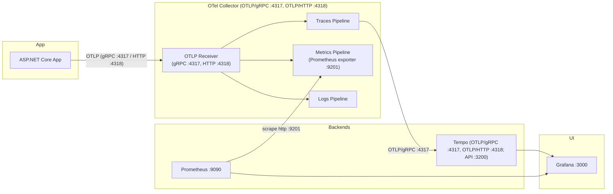

# OpenTelemetry ASP.NET Core Web API Example

This example uses the new WebApplication host that ships with .NET
and shows how to setup

1. OpenTelemetry logging
2. OpenTelemetry metrics
3. OpenTelemetry tracing

`ResourceBuilder` is associated with OpenTelemetry to associate the
service name, version and the machine on which this program is running.

The sample rate is set to emit all the traces using `AlwaysOnSampler`.
You can try out different samplers like `TraceIdRatioBasedSampler`.

## Architecture



## Running Dependencies via Docker

The example by default writes telemetry to stdout. To enable telemetry export
via OTLP, update the `appsettings.json` file to replace `"console"` with
`"otlp"`. Launching the application will then send telemetry data via OTLP.

Use the provided "docker-compose.yaml" file to spin up the
required dependencies, including:

- **OTel Collector** Accept telemetry and forwards them to Tempo, Prometheus
- **Prometheus** to store metrics
- **Grafana (UI)** UI to view metrics, traces. (Exemplars can be used to jump
  from metrics to traces)
- **Tempo** to store traces // TODO: Add a logging store also.

Once the Docker containers are running, you can access the **Grafana UI** at:
[http://localhost:3000/](http://localhost:3000/)

## Testing the ASP.NET Core API with curl

The sample exposes a single controller endpoint:

- `GET /WeatherForecast`

By default (see `appsettings.json`), Kestrel listens on:

- HTTP: `http://localhost:5010`
- HTTPS: `https://localhost:5011`

Examples:


```bash
# Call the API over HTTPS (dev cert); -k skips certificate validation
curl -sS -k https://localhost:5011/WeatherForecast | jq .
```

```bash
# Force a specific trace context to verify propagation
curl -sS -k \
  -H 'traceparent: 00-4bf92f3577b34da6a3ce929d0e0e4736-00f067aa0ba902b7-01' \
  https://localhost:5011/WeatherForecast | jq
```

```bash
# Generate a bit of load/telemetry
for i in $(seq 1 10); do
  curl -sS -k https://localhost:5011/WeatherForecast >/dev/null
done
```

## References

- [ASP.NET Core](https://learn.microsoft.com/aspnet/core/introduction-to-aspnet-core)
- [Docker](http://docker.com)
- [Prometheus](http://prometheus.io/docs)
- [Tempo](https://github.com/grafana/tempo)
